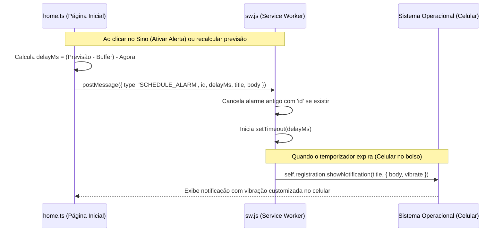

# Design Spec — Alarmes e Notificações Inteligentes no BusTracker

## 1. Objetivos
* Permitir que o usuário agende alarmes de chegada para seus trajetos ativos.
* Garantir que as notificações funcionem em segundo plano (com o celular bloqueado ou o navegador minimizado) usando o Service Worker.
* Reagendar alarmes automaticamente em primeiro plano se a IA detectar mudanças significativas na previsão do ônibus.
* Adicionar feedback tátil premium (padrão de vibração personalizado) para o alarme.

---

## 2. Arquitetura e Comunicação em Segundo Plano

---

## 3. Detalhes de Implementação

### 3.1 Service Worker (`public/sw.js`)
* **Gerenciamento de Timers:** Criar um dicionário `activeAlarms` em memória no Service Worker para guardar as referências dos `setTimeout` ativos indexados pelo ID do Preset.
* **Mensagens PostMessage:**
  * `SCHEDULE_ALARM`: Limpa o temporizador antigo (se existir) e inicia um novo `setTimeout` com o delay em milissegundos recebido. Quando disparado, remove o ID da lista e invoca `self.registration.showNotification()`.
  * `CANCEL_ALARM`: Limpa o temporizador associado ao ID e remove da lista.
* **Interação com a Notificação:**
  * Ouvir o evento `notificationclick` para focar na aba do aplicativo ou abrir a URL do app caso o usuário clique na notificação.
* **Opções de Notificação:**
  * Adicionar `vibrate: [200, 100, 200, 100, 300]` para vibração personalizada.
  * Adicionar `tag: 'bustracker-alert'` para garantir que notificações antigas sejam agrupadas ou substituídas caso haja novas previsões.

### 3.2 Página Inicial (`src/pages/home.ts`)
* **Integração com sw.js:**
  * Criar função `sendAlarmToServiceWorker(presetId, delayMs, scheduledTime, lineName, isCancellation)` para abstrair a chamada a `navigator.serviceWorker.controller.postMessage`.
* **Cálculo de Atraso (Delay):**
  * `tempoDoAlerta = predictedBusArrival - (bufferTime + estimatedBoardingOffset)`
  * `delayMs = tempoDoAlerta - horaAtual`
* **Gerenciamento de Ciclo de Vida do Alarme:**
  * Toda vez que `updateTrackerView` rodar, se as notificações estiverem ativas para o preset e a previsão mudar, recalcular o `delayMs`.
  * Se o ônibus já tiver passado ou a previsão for no passado (`delayMs <= 0`), cancelar o alarme imediatamente.
  * Se estiver no futuro (`delayMs > 0`), enviar mensagem de reagendamento para o Service Worker com o mesmo ID, o que substituirá silenciosamente o alarme no cache do SW.

---

## 4. Plano de Verificação

### Testes Manuais
1. **Ativação:** Ativar o alerta de um trajeto na Home e verificar os logs do console para confirmar a mensagem enviada ao Service Worker.
2. **Disparo com Tela Bloqueada:** Agendar um alarme para disparar dali a 2 minutos, bloquear a tela do celular e verificar se a notificação chega no horário exato com a vibração customizada.
3. **Reagendamento:** Agendar um alarme e simular uma nova previsão mudando no app (ex: abrindo um preset diferente ou recalculando). Verificar nos logs se o alarme antigo foi cancelado e o novo agendado.
4. **Navegação:** Clicar na notificação disparada e checar se ela abre/foca o aplicativo na tela Home.
