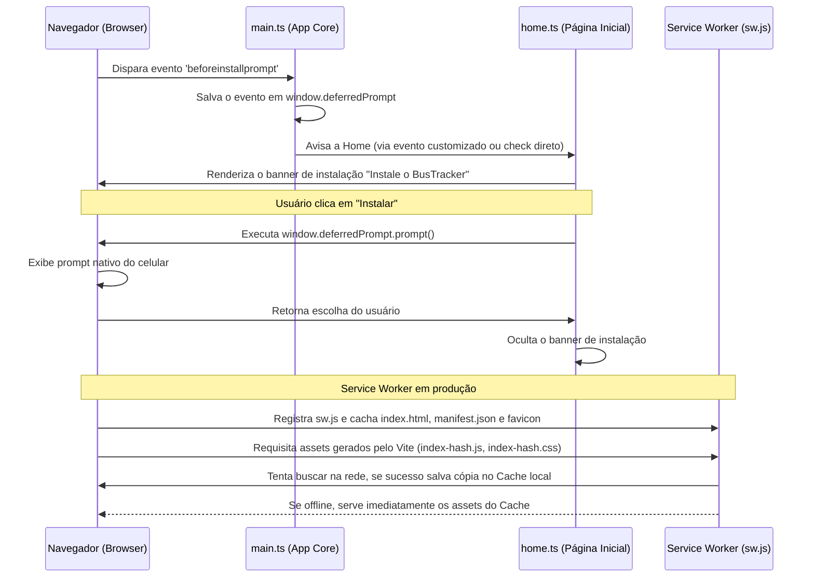

# Design Spec — PWA Instalável e Offline no BusTracker

## 1. Objetivos
* Tornar o BusTracker instalável como aplicativo nativo no celular (PWA).
* Garantir funcionamento 100% offline (carregamento instantâneo de telas e banco de dados IndexedDB).
* Exibir um banner de instalação customizado e profissional na tela principal (Home) se o app puder ser instalado, sumindo após a instalação ou se o usuário recusar.
* Corrigir bugs de tipagem TypeScript no `sw.js` que impediam a ativação correta do PWA no navegador.

---

## 2. Arquitetura e Fluxo de Dados

---

## 3. Componentes e Mudanças Propostas

### 3.1 Manifesto do App (`public/manifest.json`)
* **Ajuste de Cores:** Mudar o `theme_color` de `#6366f1` (antigo azul indigo) para `#f97316` (Laranja Transit Orange do novo tema do app) e ajustar o `background_color` para `#09090b` para casar perfeitamente com o fundo escuro padrão do CSS.

### 3.2 Service Worker (`public/sw.js`)
* **Corrigir Tipagem:** Remover toda e qualquer tipagem do TypeScript (`: any`, `as any`) para torná-lo um arquivo de Javascript Vanilla válido, evitando quebras de sintaxe no navegador.
* **Estratégia de Cache Dinâmico:** 
  * Caching inicial estático apenas de `/`, `/index.html`, `/favicon.ico` e `/manifest.json`.
  * Todo o resto (assets hashificados compilados do Vite) será cacheado dinamicamente no primeiro carregamento através da estratégia **Network First com Fallback para Cache**.
  * Ignorar scripts internos de desenvolvimento do Vite (HMR) para não atrapalhar o desenvolvimento local.

### 3.3 Registro no Core (`src/main.ts`)
* **Captura de Prompt:** Escutar o evento `beforeinstallprompt`, impedir o prompt padrão de aparecer imediatamente e salvar a referência em `(window as any).deferredPrompt`.
* **Registro de SW:** Registrar o `/sw.js` se estiver em ambiente de produção (`import.meta.env.PROD`).

### 3.4 Interface do Usuário (`src/pages/home.ts`)
* **Banner de Instalação:** Adicionar um container `#pwa-install-banner` no topo da Home.
* **Lógica Interativa:**
  * Se `(window as any).deferredPrompt` já existe e o banner não foi dispensado na sessão atual (`sessionStorage`), desenhar o banner.
  * Capturar o clique em "Instalar" para acionar o prompt nativo e limpar a referência depois de usado.
  * Capturar o clique em "Fechar" para ocultar o banner e salvar no `sessionStorage` (não perturba mais na sessão).
  * Escutar por um evento personalizado `'can-install-pwa'` disparado do `main.ts` caso o prompt seja detectado após o carregamento da Home.

---

## 4. Plano de Verificação

### Testes Manuais
1. **Instalação:** Abrir o app no navegador e verificar se o banner aparece. Clicar em "Instalar" e testar se o prompt nativo do navegador é aberto.
2. **Modo Offline:** Desativar a conexão de rede no DevTools (modo Offline) e recarregar a página. O app deve abrir e funcionar normalmente, buscando dados do IndexedDB.
3. **Persistência do Banner:** Clicar no botão "Fechar" (x) do banner e recarregar a página. O banner não deve reaparecer na mesma sessão do navegador.
